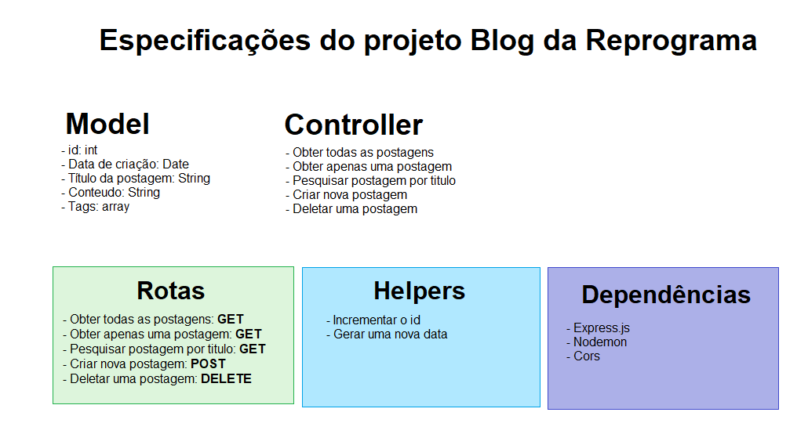

# Blog Reprograma

O projeto é destinado para criar novas postagens, deletar, visualizar todas ou apenas uma, por id ou por titulo, utilizando boas práticas e estrutura de pastas, seguindo o design MVC, nesse projeto apenas implementados o model e o controller, responsabilidades da desenvolvedora backend. 

# Motivação

Aprender e praticar os conceitos de POST e DELETE, integrantes dos métodos HTTP.

# Arquitetura 

# Ferramentas utilizadas

* Nodejs
* Expressjs
* Cors
* Nodemon

