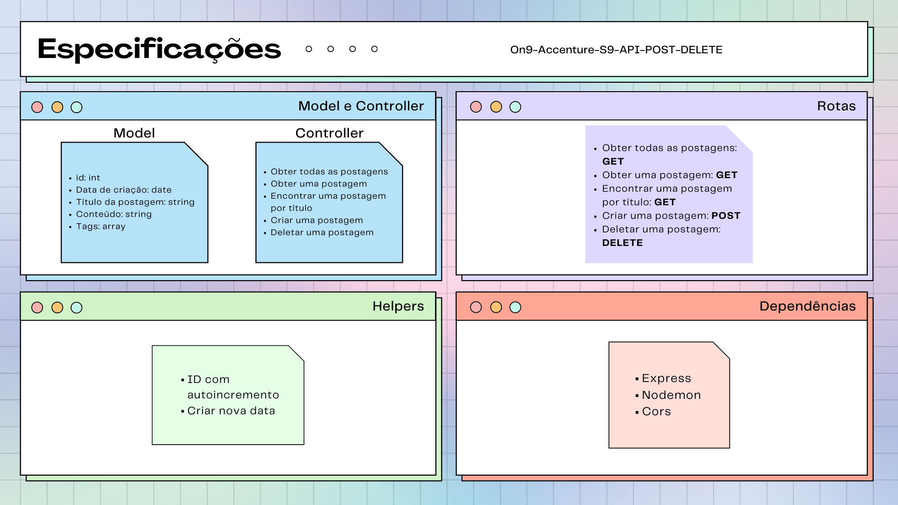

# On9-Accenture-S9-API-POST-DELETE

# Postagens

Projeto com o objetivo de criar postagens, deletar, visualizar todas ou apenas uma, utilizando boas práticas de estruturação de pastas com o design MVC.

# Motivação

Aprender os conceitos dos verbos POST e DELETE.

# Arquitetura 

# Ferramentas utilizadas

* Nodejs
* Expressjs
* Cors
* Nodemon
