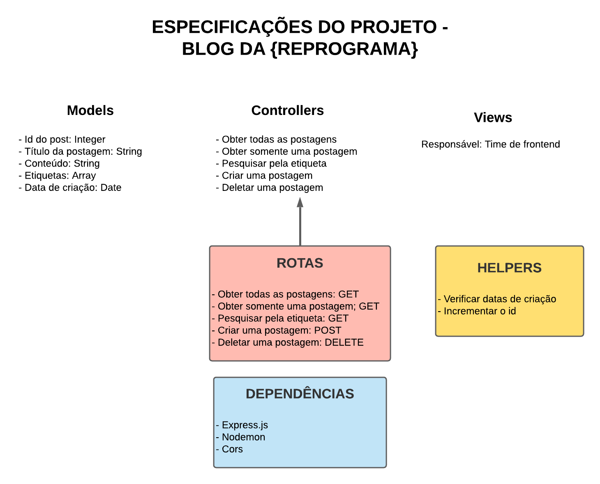

# Blog da Reprograma

O objetivo do projeto é criar novas postagens, deletar e visualizar todas ou apenas uma, utilizando boas práticas e estrutura de pastas, seguindo o design MVC. 

# Motivação

Aprender os conceitos de POST e DELETE, integrantes dos métodos HTTP.

# Arquitetura 

# Ferramentas utilizadas

* Nodejs
* Expressjs
* Cors
* Nodemon