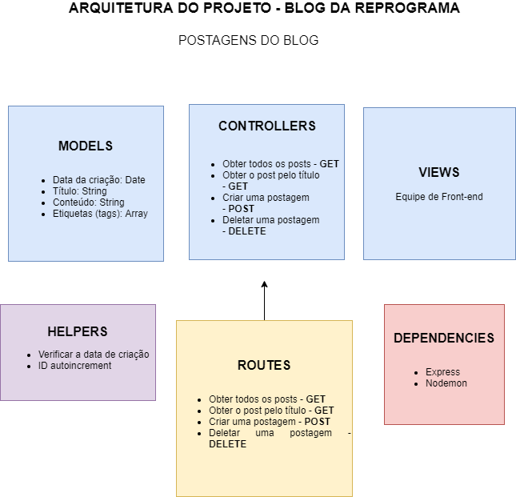

# Motivação 

Colocar em prática o conteúdo aprendido sobre os métodos http (GET, POST e DELETE) em um projeto de uma API para postagens em um Blog, seguindo a arquitetura MVC em sua construção.

# Arquitetura
 

Controllers - Retornar postagens, Retornar postagem pelo id, Criar postagens e apagar postagens
Models - Titulo do post, data de criação, conteúdo e etiquetas
Routes - GET (retornar as postagens), POST (criar nova postagem), DELETE (deletar postagem)
Helpers - Data de criação e ID autoincrement

# Dependências utilizadas
    Express.js
    Nodemon
    