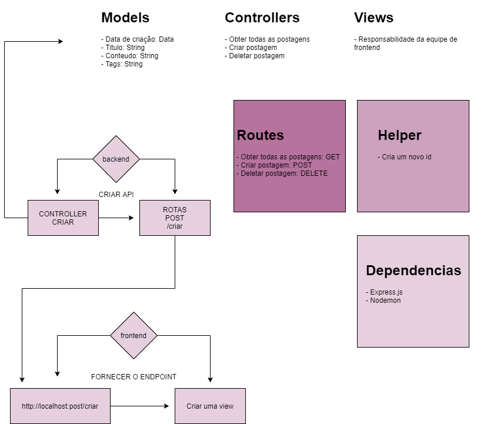

<h1> Desafio da semana 09 </h1> 

<h2><b>Motivação</h2></b>

Aprender os conceitos de POST e DELETE, integrantes dos métodos HTTP.

<h2><b>Arquitetura</h2></b>

<h2><b>Ferramentas Utilizadas</h2></b>

- Nodejs
- Expressjs
- Nodemon