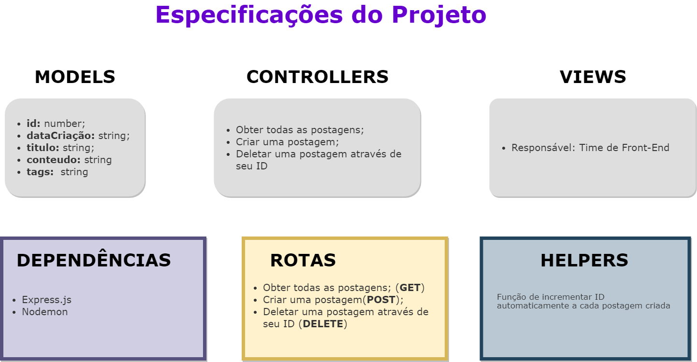

# Atividade-bonus

## **Motivação**

O desafio da semana foi desenvolvido com o objetivo de aprendermos a construir uma API que:

1. crie uma postagem para o blog do Reprograma; (através do método POST)
2. permita que o ID de cada uma recém-criada se incremente automaticamente 
3. delete uma delas se desejarmos (através do método DELETE).

## **Arquitetura**

Arquitetura do projeto - Blog do Reprograma

## **Ferramentas utilizadas**

A API foi desenvolvida com a ajuda do **Node.js** e os seus módulos **Nodemon** e **Express.js**